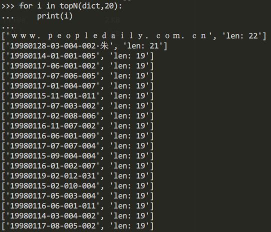
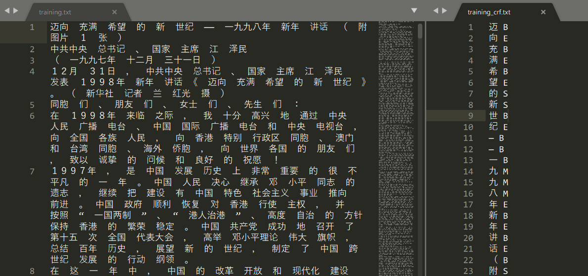
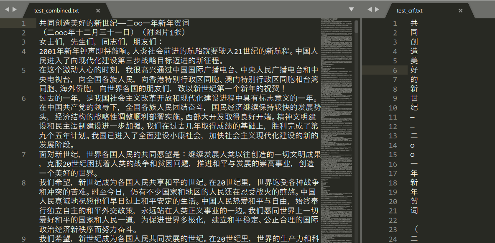
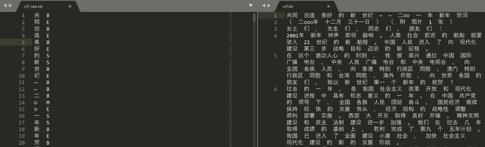

# chinese_word_segmentation
一些中文分词算法实现，NLP课的课后实践。

## 1 Model

### 1.1 RMM

```bash
python RMM.py 待分词文件 输出文件 词表
```

**PS:** 

最大匹配法需要获取词表最长单词长度`max_word_len`，每次都从待切分序列取这个长度做切分。利用`utils/dict.topN(word_list,N)`方法可以查看词表中最长的N个单词。观察词表，最长的几个单词都是无意义的字符串，每次迭代都会造成无意义计算。



所以在`RMM.py`中手动指定`max_word_len`：

```python
# max_word_len=max(len(word) for word in word_list) # 选择字典中最长单词
max_word_len=17 # 手动指定最长单词
```

### 1.2 CRF

#### 1.2.1 模型训练

- 数据准备

  运行命令将数据转换为BMES格式

  ```bash
  python utils\sentence2crf.py -i data\training.txt -o data\training_crf.txt  -m 1
  ```

  

- 选取特征模板

  定义`CRF/template_01`特征模板，训练要用到，模板中参数的含义见[2]。

- 训练

  使用命令开始训练，可选参数见[4, 5]，训练完成后会得到一个模型文件。
  
  ```bash
  crf_learn template_file train_file output_model
  ```


#### 1.2.2 预测

- 待分词文件转换格式

  ```bash
  python utils\sentence2crf.py -i data\test_combined.txt -o data\test_crf.txt  -m 2
  ```

  

- 进行预测

  ```bash
  crf_test -m model_file test_file>result_file
  ```

- 根据标签组合句子

  ```
  python utils\crf2sentence.py output\crf_raw.txt output\crf.txt
  ```

  

## 2 模型评价

```bash
perl scripts/score 词表 标准答案 分词预测>score.txt
```

## 3 分词结果优化

- 验证集选取

  由于作业不能利用测试集调参，所以从训练集中选取`0.1`比例的数据来作为验证集，观察模型表现，寻找优化空间。

  ```bash
  python utils/val_data_gen.py ./data/training.txt ./data/val_truth.txt 0.1
  ```

- 将生成的验证集中的空格合并

  ```bash
  python utils/combine.py ./data/val_truth.txt ./data/val.txt
  ```

- 运用crf模型对验证集做出预测，对比预测结果和答案，观察分词效果不好的地方，提出相应解决方案，之后在测试集上进行评测。（以template_0生成的crf模型为基准）

  | 问题                          | 解决方法                                                | R      | P      | F1     | OOVR   | IVR   |
  | ----------------------------- | ------------------------------------------------------- | ------ | ------ | ------ | ------ | ----- |
  | <span style="">crf基准</span> | /                                                       | 0.924  | 0.937  | 0.930  | 0.595  | 0.944 |
  | 部分数字、日期切分错误        | 定义正则规则，在分词结果上强制切分日期、年份等特殊格式* | +0.004 | +0.003 | +0.004 | +0.059 | -     |
  
  *分词结果修正代码见`utils/patch_it.py`，凡是`regRules`能匹配到的词语，都会被脚本强制分词。运行方法：
  
  ```bash
  python utils/patch_it.py path_to_src path_to_des
  ```

## 4 PS

- 用perl命令进行打分前，记得核对下`答案.txt`和`预测值.txt`的句子总数是否相同，如果中间少预测一个句子，就会导致对不上，严重影响打分！

## 5 参考

[1] 自然语言处理CRF中文分词处理. https://www.bilibili.com/video/BV1Fb411w7ob?from=search&seid=11802779980530652990

[2] 利用crf++进行实体识别. https://zhuanlan.zhihu.com/p/27955621

[3] CRF++: Yet Another CRF toolkit. https://taku910.github.io/crfpp/

[4] CRF++的使用和模板理解. https://blog.csdn.net/qq_39023569/article/details/88972234

[5] CRF++模型格式说明. http://www.hankcs.com/nlp/the-crf-model-format-description.html